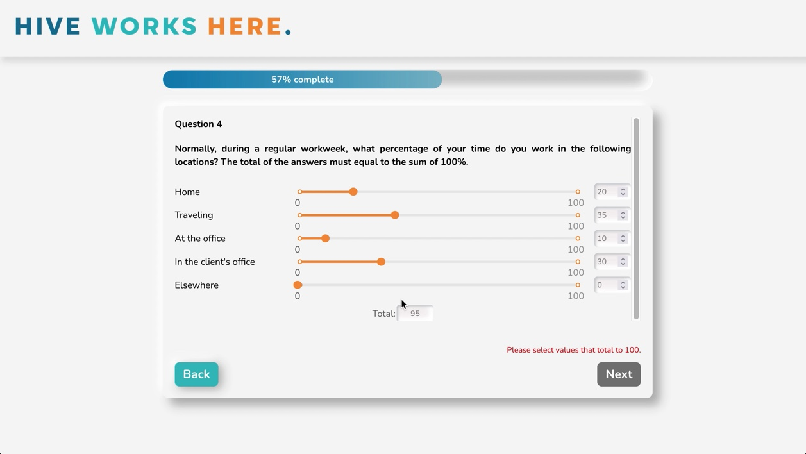

# Survey Management Project

## Description

This is a web application to create customizable and user-friendly surveys, fill out these same surveys, and then view the collected response data in charts, graphs, and maps. 

## About the Project

This app was created as the final project in a 6-month full-stack bootcamp. It is a MERN (MongoDB, ExpressJS, ReactJS, Node.js) application made of two processes:

1. An Express "server" providing API support for retrieving and submitting data from the backend.
2. A React "client" providing a web-based UI. 
This project also leverages a cloud-based instance of MongoDB for storing and retrieving data.

## Application Features

Admin portal:
- select from eight pre-built survey question types
- edit the question and response option text, as well as add or delete response options
- delete questions from the survey
- drag and drop questions to a different order and their numbering will automatically update
- save the survey to the database
- clone or edit previously saved surveys
- view the user's submitted responses on charts, graphs, and maps
- manually enter additional postal codes to be plotted on the maps (e.g., to see the distance between survey responders and a proposed new office location)

User side:
- follow a link to fill out the survey anonymously
- the survey contains validation checks to ensure all fields are filled out properly before a user can continue to the next question
- can use the back button to go to a previous question, and the survey will remember the user's answers

## Running the App

In a command shell, run the commands:

``npm install``

``npm start``

Your browser should open to http://localhost:4444. The React development system is running on port 4444.

## Key Learnings

- designing and building a full-stack survey management web application with both a user and an admin side connected to our database
- technologies including Node.js, Express, React, MongoDB, Mongoose, JavaScript, HTML, CSS, Git, GitHub, Adobe Illustrator, Adobe After Effects, Google Maps, and Trello
- communicating clearly and proactively within the development team, as well as with the product owner, scrum master, and client
- working in an agile/scrum team environment

## Screenshots

### Admin Portal

### User Side

